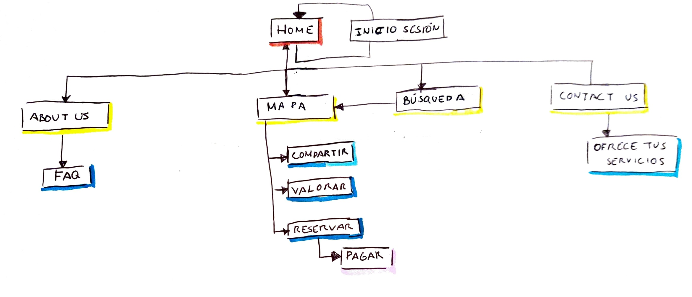

# DIU - Practica2, entregables

## Ideación

Debemos idear una propuesta turística para impulsar el turismo en tiempos de pandemia en Granada. Para ello, se diseñará una supuesta aplicación de forma que se cubran las necesidades de los potenciales usuarios.

### Malla receptora de información

Hemos decidido crear una malla receptora a partir de la experiencia de nuestras dos personas de la práctica anterior: Diego y Mei. Hemos considerado ésta la mejor opción, pues nos permite identificar de un vistazo rápido las conclusiones de su viaje.

## Propuesta de valor

Nuestra propuesta se trata de una aplicación con un objetivo simple y necesario, crear una app de planificación de viajes cuyo objetivo sea promover las eventos ocioculturales al aire libre, para que todos podamos disfrutar de actividades reguladas con protocolo covid y compartamos con amigos y familiares un ocio seguro en Granada.

En los *users needs*, hemos reflejado los principales matices que los usuarios valoran a la hora de utilizar una aplicación. Además, éstos podrán realizar distintas acciones como dejar valoraciones, reservar servicios, compartir viajes y otras opciones similares.

Hemos diseñado un roadmap para el desarrollo de la app. Consideramos primordial un sistema de recomendaciones personalizadas, dado que puede marcar la diferencia entre la vida y la muerte del sistema. Por ello, se creará lo más pronto posible. A la larga, pensamos que es conveniente una aplicación web progresiva disponible para todos los sistemas móviles. Facilitaría el desarrollo cross-platform y proporcionaría flexibilidad a los usuarios a la hora de usarla. Finalmente, se propone expandir el conocimiento de su existencia mediante contratos y marketing.

Mediremos el éxito de la aplicación mediante los informes ofrecidos por los proveedores de servicios (por ejemplo: tránsito de gente que viene desde nuestra app), feedback de los usuarios e ingresos.

## Task analysis

A partir de nuestro scope canvas, hemos razonado sobre quiénes serían nuestros principales usuarios. Hemos identificado dos tipos principales: **empresas** y **usuarios**.
- Los **usuarios** usarán la aplicación con la finalidad de viajar. Serán capaces de reservar puntos de ruta, buscar puntos de interés, compartir sus planificaciones, y dejar reseñas. Es el flujo habitual.
Dentro de éste grupo debemos distinguir tres categorías distintas:
    - **Familias**, como viajes de pareja, matrimonios...
    - **Grupos**, como amigos, viajes del inserso... Su experiencia será ligeramente distinta a la anterior.
    - **Individuos**: personas que viajan solas.
- Las **empresas** deben poder añadir sus servicios a la aplicación. En principio, su workflow es distinto al de un usuario habitual, pues únicamente se encargarán de gestionar sus entradas en la base de datos; esto es, añadir puntos de interés, modificar la información sobre éstos, eliminarlos...

## Arquitectura de información

### Sitemap

### Labelling

| Etiqueta        | Descripción           |
| :-------------: |:-------------:|
| Inicio      | Página principal del sitio. Se describen las funcionalidades de la aplicación, los protocolos Covid seguidos, enlaces a los distintos lugares de la página... |
| Iniciar sesión      | Permite a los usuarios registrarse o acceder a su cuenta con el fin de poder usar la aplicación      |
| Sobre nosotros | About us. Muestra información sobre los desarrolladores, así como el proyecto|
| Preguntas frecuentes | FAQ. Se resuelven las dudas habituales relacionadas con el uso de la aplicación, los servicios, pagos...|
| Búsqueda | Listado de los servicios disponibles. Se pueden buscar las actividades y los hoteles disponibles junto con su información.  |

## Prototipo Lo-FI Wireframe

## Conclusiones
(incluye valoración de esta etapa)
