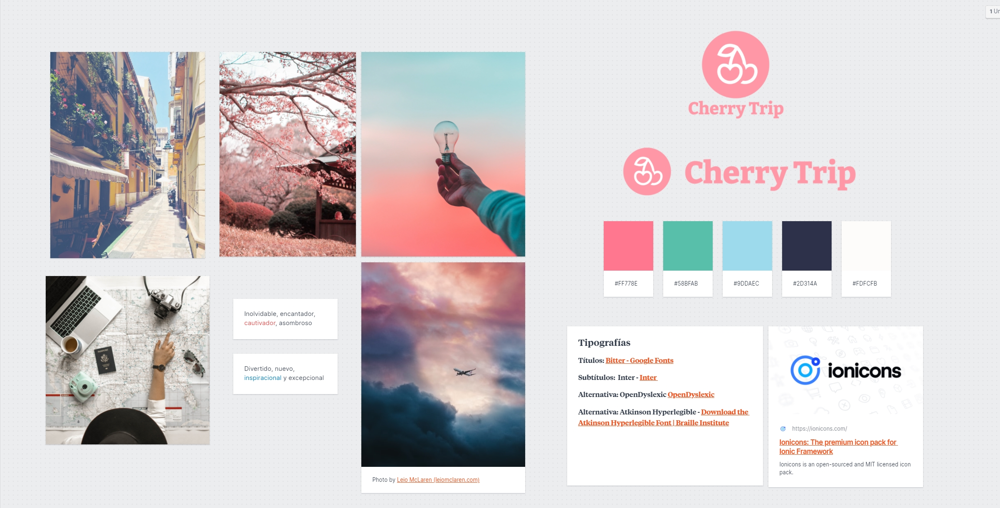
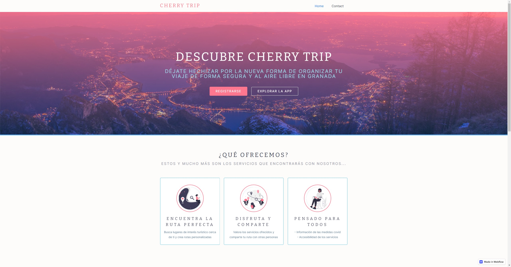
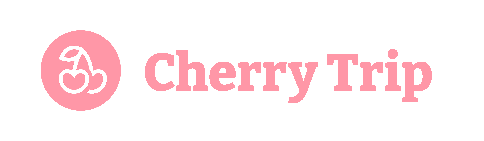
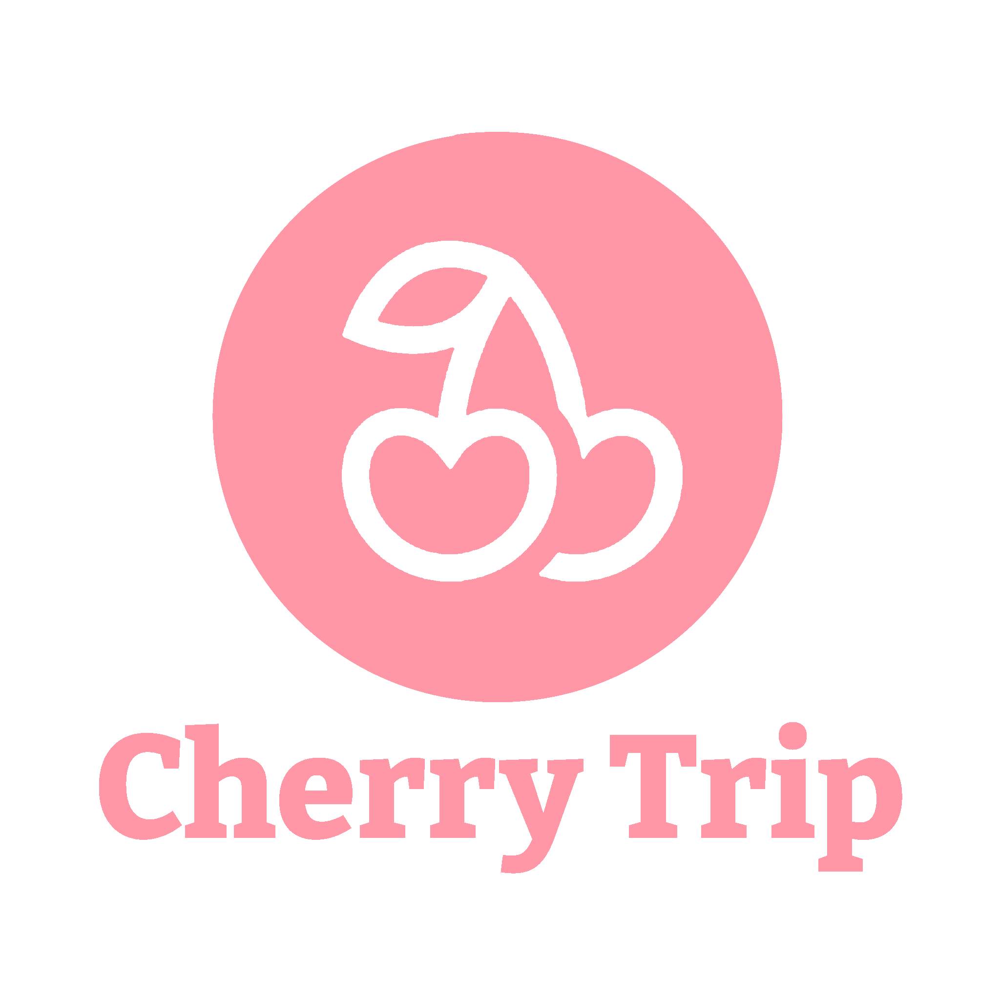
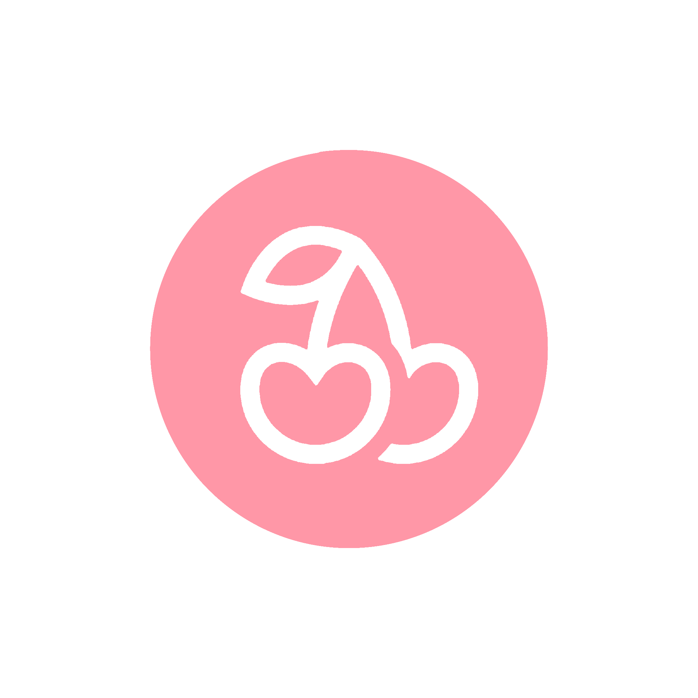
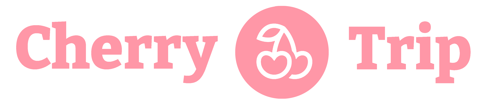
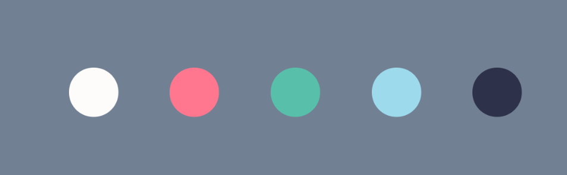

# DIU - Practica 3, entregables

En esta práctica, vamos a definir el estilo visual de nuestra aplicación. Para conseguirlo, necesitaremos inspiración, tipografías, estilos visuales... A lo largo de este README detallaremos los pasos que hemos seguido para conseguirlo.

## Moodboard (diseño visual + logotipo)

Empezamos creando un Moodboard, un tablón con distintas imágenes inspiracionales. Nos proporcionará un buen punto de inicio. En él, figuran algunos elementos que analizaremos con más detalle en la sección [Guidelines](##Guidelines), entre los que se encuentran la tipografía y la paleta de colores.

## Landing Page [(link)](https://cherrytriplandingpage.webflow.io/)

Partiendo de nuestro [Wireframe de la práctica anterior](https://github.com/Asmilex/DIU21/tree/master/P2#prototipo-lo-fi-wireframe), diseñamos la landing page. En ella, debemos presentar el objetivo del proyecto **con claridad**. Para conseguirlo, necesitamos:
- **Un logotipo reconocible**. El nuestro lo hemos diseñado TODO
- **Un título sugerente**, seguido de **subtítulos** en los que mostremos los principales atractivos de la aplicación.
- Elementos gráficos que refuercen el significado.

El diseño de la página es del tipo scroll suave continuo, de forma que los alicientes se descubren poco a poco. Esto permite centrar la atención a unos pocos puntos a la vez.

La sección [Guidelines](##Guidelines) profundizará en los motivos tras estas elecciones.

[Puedes visitar la landing page en este enlace](https://cherrytriplandingpage.webflow.io/). Utilizamos la herramienta [Webflow](www.webflow.io) para crearla.

## Guidelines

En esta sección, definiremos el estilo visual de todos los componentes de la aplicación.

### Logotipo

Durante del desarollo, ideamos varias versiones de nuestro logotipo. Al principio, teníamos el siguiente:

Finalmente, diseñamos el siguiente:

Esta imagen permite presentar la marca de distintas formas, lo que nos proporciona una gran versalitidad:

### Paleta de colores

A partir de las imágenes del Moodboard, elegimos la paleta de colores de Cherry Trip.

Es una paleta con tonalidades pasteles, agradables y suaves, que recuerdan a los colores de un atardecer nuboso. Esto es perfecto para una aplicación de este tipo, pues resulta tan relajante como un viaje.

Los códigos hexadecimales son los siguientes:

- **Blanco** `#FDFCFB`
- **Ultra rojo** `#FF778E`
- **Jade** `#58BFAB`
- **Azul** `#9DDAEC`
- **Cadete espacial** `#2D314A`

En la práctica, necesitaríamos al menos un color más para elementos como avisos, así como definir unos 7 shades de cada tonalidad. El proceso a seguir sería similar al que muestra [RefactoringUI en su artículo](https://www.refactoringui.com/previews/building-your-color-palette).

### Iconografía

Hemos escogido los iconos [Ionicons](https://ionicons.com/) para la aplicación, puesto que son muy legibles y minimalistas. Idóneo para el branding de Cherry Trip.

Las imágenes que aparecen en la landing page han sido generadas por [Undraw](https://undraw.co). Es una página que produce diseños con un color específico indicado. Son sencillos, elegantes, gratuitos y personalizables con nuestra paleta de colores.

### Tipografías

Principalmente se usarán dos tipografías, y se incluirá opción de escoger dos adicionales. Veámoslas:
- La tipografía utlizada para los títulos es [Bitter](https://fonts.google.com/specimen/Bitter). Es del tipo Sans-Serif. Esto produce un aire de elegancia atractivo. Uno de los principales motivos por los que la hemos elegido es que, aún siendo Sans-Serif, es muy legible.
- Para el cuerpo y los subtítulos usaremos [Inter](https://rsms.me/inter/). Es una fuente moderna diseñada específicamente para aumentar la legibilidad en pantallas. Es adaptable, tiene muchísimos glifos (lo que cubre todos los posibles idiomas a los que se pudiera expandir Cherry Trip) y funciona bien a todos los tamaños.
- Para nuestros usuarios con problemas de visión, presentamos dos opciones. Podrán seleccionar estas letras desde su configuración
  - La primera de ellas es [OpenDyslexic](https://opendyslexic.org/). Está pensada para personas *dixélicas*. Es de código abierto.
  - [Atkinson Hyperlegible](https://brailleinstitute.org/freefont), por el instituto del Braille. Se diseñó con el fin de ser legible para todo tipo de usuarios, aunque presenten problemas de vista como astigmatismo, hipermetropía o similares. Exagera los glifos para conseguirlo.

### Patrón de diseño

Hemos utilizado una combinación de dos patrones de diseño: para la landing page, Webflow nos proporcionó un diseño similar al de las versiones antiguas de Material Design. Para el mockup High-Fi, hemos decidido implementar una variante casera del [Neumorfismo](https://uxdesign.cc/neumorphism-in-user-interfaces-b47cef3bf3a6) que se está poniendo de moda.

### Estilo de lenguaje

El lenguaje a usar en toda la aplicación; esto es, tanto landing page, como documentos, mapa y buscador, debe ser relajado. Se debe evitar usar tecnicismos y sentencias innecesariamente largas.

El objetivo es que **Cherry Trip pueda ser usado por cualquier persona**: ya sean personas con un gran transfondo cultural, como personas que nunca habían usado antes una aplicación de viajes.

## Mockup: LAYOUT HI-FI

## Documentación: Publicación del Case Study

Dado que nuestro case study ha tomado forma, es hora de publicarlo para que el resto de personas puedan leerlo.

Github proporciona una herramienta llamada [Github Pages](https://pages.github.com/). Para simplificar el proceso y conseguir un buen diseño de base, usamos [Docsify](https://docsify.js.org/#/). Aunque está diseñada para documentación del código, podemos adaptarlo para nuestro README principal.

Por motivos técnicos, tuvimos que mover este fichero a la carpeta `./docs`. Por tanto, en el README principal se incluye un enlace a este nuevo archivo.

El resultado se puede ver en la página [asmilex.github.io/DIU21](https://asmilex.github.io/DIU21/#/).

## Valoración

En general, esta práctica nos ha parecido la más complicada de todas. El proceso creativo requerido para construir una imagen de una entidad es largo y complejo. Simplificarlo todo en unas cuantas semanas e introduciendo además bocetos en alta resolución es difícil. Sin embargo, consideramos que hemos hecho un trabajo sólido.
