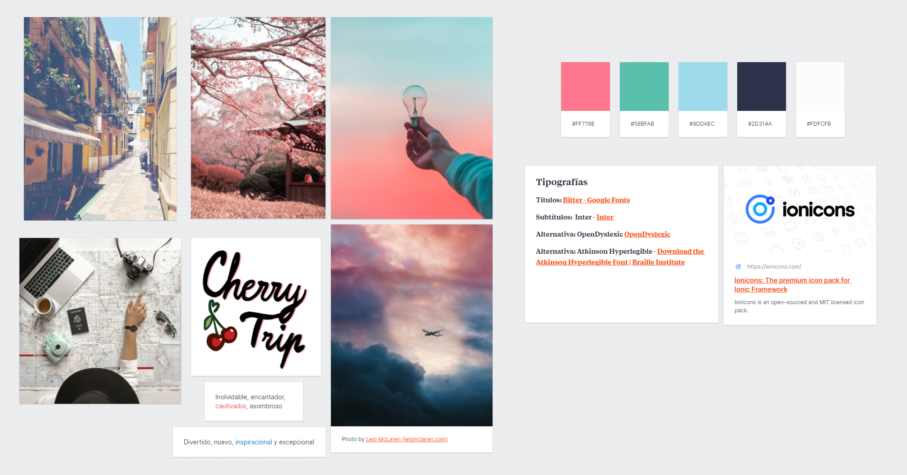

# DIU - Practica 3, entregables

En esta práctica, vamos a definir el estilo visual de nuestra aplicación. Por tanto, necesitaremos inspiración, tipografías, estilos visuales... A lo largo de este README detallaremos los pasos que hemos seguido para conseguirlo.

## Moodboard (diseño visual + logotipo)

Empezamos creando un Moodboard, un tablón con distintas imágenes inspiracionales. Nos proporcionará un buen punto de inicio. En él, figuran algunos elementos que analizaremos con más detalle en la sección [Guidelines](##Guidelines), entre los que se encuentran la tipografía y la paleta de colores.

## Landing Page

Partiendo de nuestro [Wireframe de la práctica anterior](../P2/README.md), diseñamos la landing page. En ella, debemos declarar el objetivo del proyecto **con claridad**. Para conseguirlo, necesitamos:
- **Un logotipo reconocible**. El nuestro lo hemos diseñado TODO
- **Un título sugerente**, seguido de **subtítulos** en los que mostremos los principales atractivos de la aplicación.
- Los anteriores puntos deben ir acompañados de elementos gráficos que refuercen el significado.
- El diseño de la página es del tipo scroll suave continuo, de forma que los alicientes se descubren poco a poco. Esto permite centrar la atención a un único punto a la vez.

La sección [Guidelines](##Guidelines) profundizará en los motivos tras estas elecciones.

## Guidelines

En esta sección, definiremos el estilo visual de todos los componentes de la aplicación.

### Paleta de colores

A partir de las imágenes del Moodboard, elegimos la paleta de colores de Cherry Trip.

Es una paleta con tonalidades pasteles, agradables y suaves, que recuerdan a los colores de un atardecer nuboso. Esto es perfecto para una aplicación de este tipo, pues resulta tan relajante como un viaje.

Los códigos hexadecimales son los siguientes:
- Blanco #FDFCFB
- Rosáceo #FF778E
- Verde #58BFAB
- Azul #9DDAEC
- Oscuro #2D314A

En la práctica, necesitaríamos al menos un color más para elementos como avisos, así como definir unos 7 shades de cada tonalidad. El proceso a seguir sería similar al que muestra [RefactoringUI en su artículo](https://www.refactoringui.com/previews/building-your-color-palette).

### Iconografía

Hemos escogido los iconos [Ionicos](https://ionicons.com/) para la aplicación, puesto que son muy legibles y minimalistas. Idóneo para el branding de Cherry Trip.

Las imágenes que aparecen en la landing page han sido generadas por [Undraw](https://undraw.co). Es una página que produce diseños con un color específico indicado. Son sencillos, elegantes, gratuitos y personalizables con nuestra paleta de colores.

### Tipografías

Principalmente se usarán dos tipografías, y se incluirá opción de escoger dos adicionales. Veámoslas:
- La tipografía utlizada para los títulos es [Bitter](https://fonts.google.com/specimen/Bitter). Es del tipo Sans-Serif. Esto produce un aire de elegancia atractivo. Uno de los principales motivos por los que la hemos elegido es que, aún siendo Sans-Serif, es muy legible.
- Para el cuerpo y los subtítulos usaremos [Inter](https://rsms.me/inter/). Es una fuente moderna diseñada específicamente para aumentar la legibilidad en pantallas. Es adaptable, tiene muchísimos glifos (lo que cubre todos los posibles idiomas a los que se pudiera expandir Cherry Trip) y funciona bien a todos los tamaños.
- Para nuestros usuarios con problemas de visión, presentamos dos opciones. Podrán seleccionar estas letras desde su configuración
  - La primera de ellas es [OpenDyslexic](https://opendyslexic.org/). Está pensada para personas *dixélicas*. Es de código abierto.
  - [Atkinson Hyperlegible](https://brailleinstitute.org/freefont), por el instituto del Braille. Se diseñó con el fin de ser legible para todo tipo de usuarios, aunque presenten problemas de vista como astigmatismo, hipermetropía o similares. Exagera los glifos para conseguirlo.

### Patrón de diseño

TODO Neumorfismo?

### Estilo de lenguaje

El lenguaje a usar en toda la aplicación; esto es, tanto landing page, como documentos, mapa y buscador, debe ser relajado. Se debe evitar usar tecnicismos y sentencias innecesariamente largas.

El objetivo es que **Cherry Trip pueda ser usado por cualquier persona**: ya sean personas con un gran transfondo cultural, como personas que nunca habían usado antes una aplicación de viajes.

## Mockup: LAYOUT HI-FI

## Documentación: Publicación del Case Study

Github pages opciones
- Galileo theme https://github.com/rowanoulton/galileo-theme <----- es de viajes
- Kasper https://rosario.io/2013/11/10/kasper-theme-for-jekyll.html
- The Plain https://heiswayi.github.io/the-plain/
- Modern Resume https://github.com/sproogen/modern-resume-theme
- Kagami https://banana.moe/jekyll-theme-kagami/about.html
- Scriptor https://scriptor-jekyll.netlify.app/
-

(incluye) Valoración del equipo sobre la realización de esta práctica o los problemas surgidos
