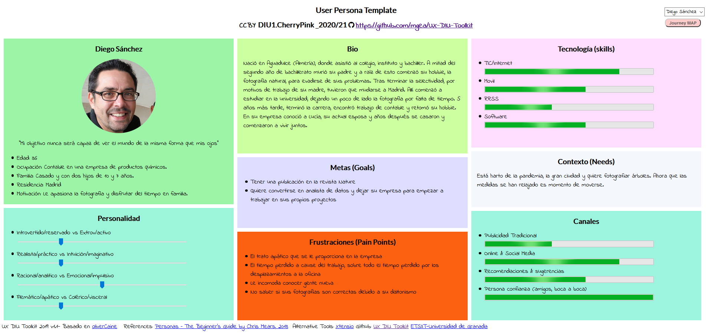
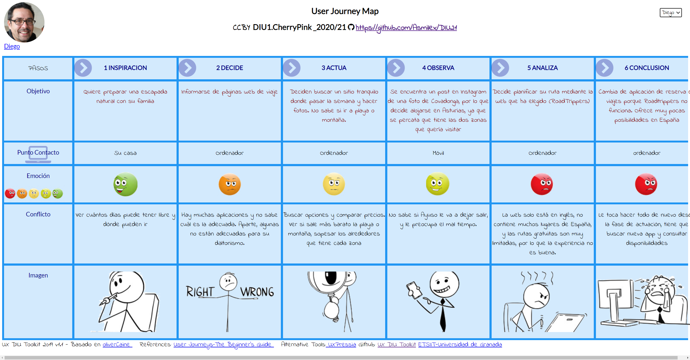
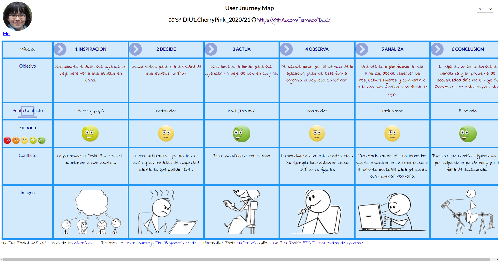

# DIU21
Prácticas Diseño Interfaces de Usuario 2020-21 (Tema: Turismo)

Grupo: DIU1_01AABB.  Curso: 2020/21
Updated: 8/2/2021

Proyecto:
>>> Decida el nombre corto de su propuesta en la práctica 2

Descripción:

>>> Describa la idea de su producto en la práctica 2

Logotipo:
>>> Opcionalmente si diseña un logotipo para su producto en la práctica 3 pongalo aqui

Miembros:
- :bust_in_silhouette:   Andrés Millán    :octocat: github.com/Asmilex
- :bust_in_silhouette:  María Sánchez     :octocat: github.com/LocalPinkRobin

-----

>>> Este documento es el esqueleto del report final de la práctica. Aparte de subir cada entrega a PRADO, se debe actualizar y dar formato de informe final a este documento online. Elimine este texto desde la práctica 1

# Proceso de Diseño

## Paso 1. UX Desk Research & Analisis

 1.a Competitive Analysis
-----

Entre las opciones de las que disponíamos, las cuales eran *Inspirock*, *Roadtrippers*, *Tripit* y *Lambus*, hemos optado por **Roadtrippers**. Los motivos son los siguientes:
- La página web de Tripit no cargaba para María, y Andrés no podía acceder ni a Tripit ni a Inspirock.
- Lambus necesitaba instalar aplicación en Android.
- Roadtrippers es elegante y dispone de interfaz web, por lo que nos ha resultado la más llamativa.

 1.b Persona
-----
Hemos creado dos personas ficticias de ámbitos muy diferentes. Ambas pueden verse en la situación de usar la aplicación seleccionada, pero cada uno con sus necesidades y requerimientos únicos

### User research de Diego

### User research de Mei

>>> Comenta brevemente porqué has seleccionado a esas personas y sube una captura de pantalla de su ficha  (80-150 caracteres)

 1.c User Journey Map
----

### Journey map de Diego

### Journey map de Mei

>>> Comenta brevemente porqué has escogido estas dos experiencias de usuario (y si consideras que son habituales) (80-150 caracteres)

 1.d Usability Review
----

El documento se encuentra en la [carpeta P1](./P1/Usability%20review%20Roadtrippers.pdf).

En general, la aplicación es muy intuitiva de usar. Los mapas presentan claramente la ruta, marcan puntos de interés, y permite mirar rápidamente hoteles.

Sin embargo, existen una serie de problemas importantes que debemos destacar:
- Toda la interfaz está en inglés.
- Claramente el público objetivo es estadounidense. Fuera del país no se presenta el mismo nivel de detalle.
- El sistema de layers que usan para la gestión de la ruta necesita refinamiento. Algunas acciones básicas están escondidas detrás de elementos visuales ocultos a priori, como eliminar un punto de la ruta. Las capas no están bien integradas del todo, ni se justifica su existencia. Podrían haber sido sustituidas por un simple filtro.
- Si no se paga, la cantidad de puntos de ruta que se pueden añadir es mínima. Tanto, que no merece mucho la pena usarla.

En general, no estamos muy satisfechos con Roadtrippers, pero entendemos que hay potencial para países del extranjero. La valoración es de un 85 (Good).

## Paso 2. UX Design

 2.a Feedback Capture Grid / EMpathy map / POV
----

>>> Comenta con un diagrama los aspectos más destacados a modo de conclusion de la práctica anterior,

 Interesante | Críticas
| ------------- | -------
  Preguntas | Nuevas ideas

>>> ¿Que planteas como "propuesta de valor" para un nuevo diseño de aplicación para economia colaborativa ?
>>> Problema e hipótesis
>>>  Que planteas como "propuesta de valor" para un nuevo diseño de aplicación para economia colaborativa te
>>> (150-200 caracteres)

 2.b ScopeCanvas
----
>>> Propuesta de valor

 2.b Tasks analysis
-----

>>> Definir "User Map" y "Task Flow" ...

 2.c IA: Sitemap + Labelling
----

>>> Identificar términos para diálogo con usuario

Término | Significado
| ------------- | -------
  Login¿?  | acceder a plataforma

 2.d Wireframes
-----

>>> Plantear el  diseño del layout para Web/movil (organización y simulación )

## Paso 3. Mi UX-Case Study (diseño)

 3.a Moodboard
-----

>>> Plantear Diseño visual con una guía de estilos visual (moodboard)
>>> Incluir Logotipo
>>> Si diseña un logotipo, explique la herramienta utilizada y la resolución empleada. ¿Puede usar esta imagen como cabecera de Twitter, por ejemplo, o necesita otra?

  3.b Landing Page
----

>>> Plantear Landing Page

 3.c Guidelines
----

>>> Estudio de Guidelines y Patrones IU a usar
>>> Tras documentarse, muestre las deciones tomadas sobre Patrones IU a usar para la fase siguiente de prototipado.

  3.d Mockup
----

>>> Layout: Mockup / prototipo HTML  (que permita simular tareas con estilo de IU seleccionado)

 3.e ¿My UX-Case Study?
-----

>>> Publicar my Case Study en Github..
>>> Documente y resuma el diseño de su producto en forma de video de 90 segundos aprox

## Paso 4. Evaluación

 4.a Caso asignado
----

>>> Breve descripción del caso asignado con enlace a  su repositorio Github

 4.b User Testing
----

>>> Seleccione 4 personas ficticias. Exprese las ideas de posibles situaciones conflictivas de esa persona en las propuestas evaluadas. Asigne dos a Caso A y 2 al caso B

| Usuarios | Sexo/Edad     | Ocupación   |  Exp.TIC    | Personalidad | Plataforma | TestA/B
| ------------- | -------- | ----------- | ----------- | -----------  | ---------- | ----
| User1's name  | H / 18   | Estudiante  | Media       | Introvertido | Web.       | A
| User2's name  | H / 18   | Estudiante  | Media       | Timido       | Web        | A
| User3's name  | M / 35   | Abogado     | Baja        | Emocional    | móvil      | B
| User4's name  | H / 18   | Estudiante  | Media       | Racional     | Web        | B

. 4.c Cuestionario SUS
----

>>> Usaremos el **Cuestionario SUS** para valorar la satisfacción de cada usuario con el diseño (A/B) realizado. Para ello usamos la [hoja de cálculo](https://github.com/mgea/DIU19/blob/master/Cuestionario%20SUS%20DIU.xlsx) para calcular resultados sigiendo las pautas para usar la escala SUS e interpretar los resultados
http://usabilitygeek.com/how-to-use-the-system-usability-scale-sus-to-evaluate-the-usability-of-your-website/)
Para más información, consultar aquí sobre la [metodología SUS](https://cui.unige.ch/isi/icle-wiki/_media/ipm:test-suschapt.pdf)

>>> Adjuntar captura de imagen con los resultados + Valoración personal

 4.d Usability Report
----

>> Añadir report de usabilidad para práctica B (la de los compañeros)

>>> Valoración personal

## Paso 5. Evaluación de Accesibilidad

  5.a Accesibility evaluation Report
----

>>> Indica qué pretendes evaluar (de accesibilidad) sobre qué APP y qué resultados has obtenido

>>> 5.a) Evaluación de la Accesibilidad (con simuladores o verificación de WACG)
>>> 5.b) Uso de simuladores de accesibilidad

>>> (uso de tabla de datos, indicar herramientas usadas)

>>> 5.c Breve resumen del estudio de accesibilidad (de práctica 1) y puntos fuertes y de mejora de los criterios de accesibilidad de tu diseño propuesto en Práctica 4.

## Conclusión final / Valoración de las prácticas

>>> (90-150 palabras) Opinión del proceso de desarrollo de diseño siguiendo metodología UX y valoración (positiva /negativa) de los resultados obtenidos
