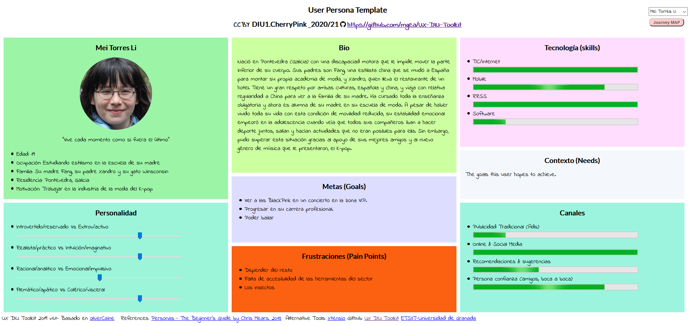
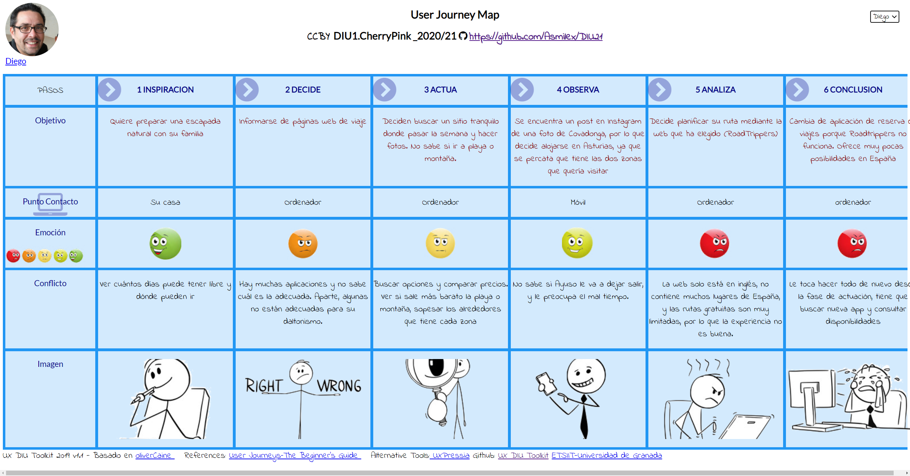
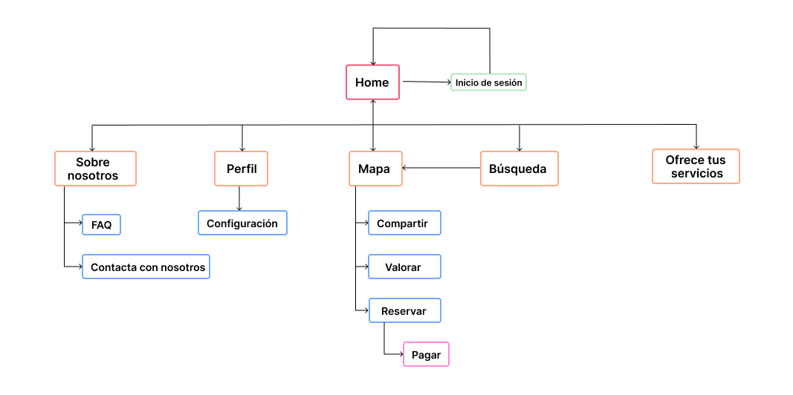
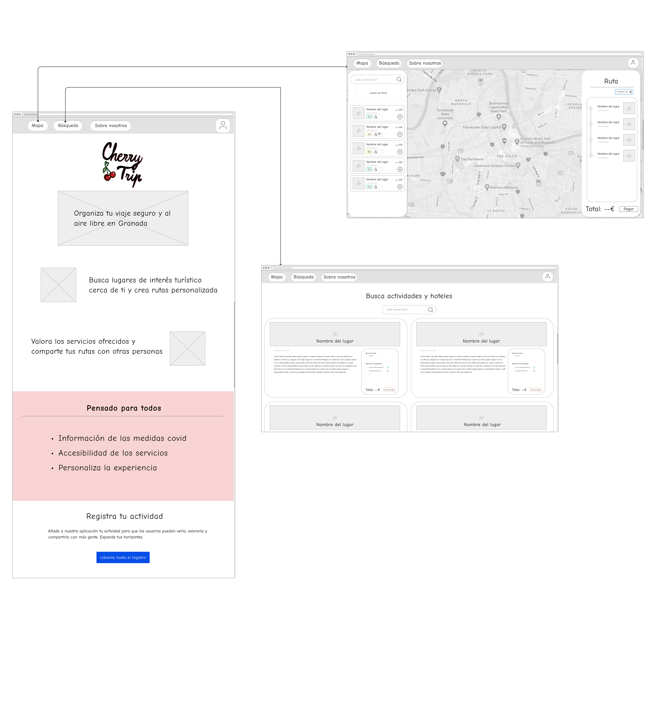
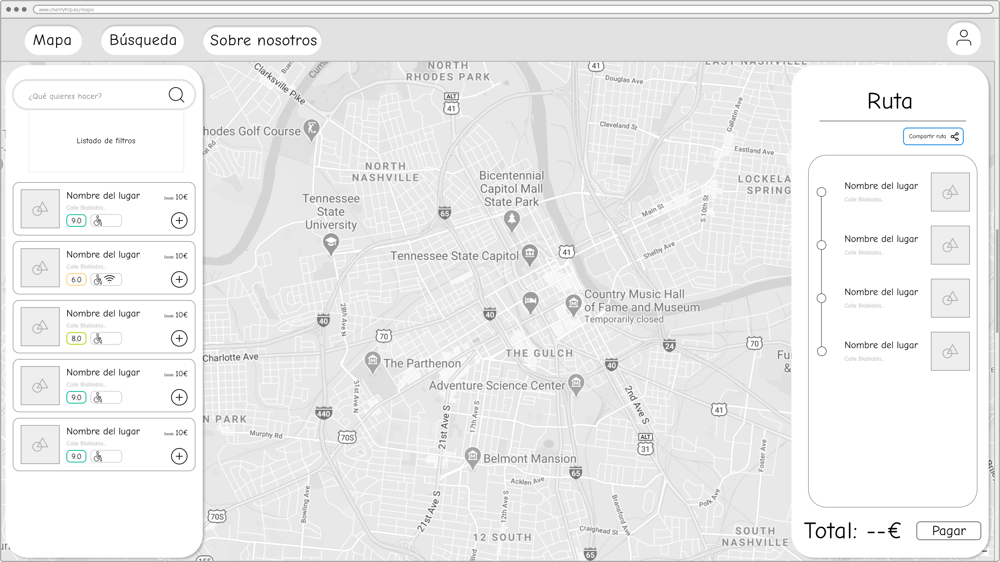
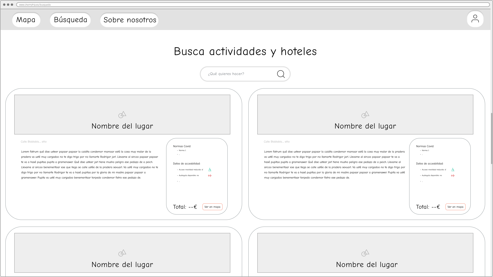

# DIU21

Prácticas Diseño Interfaces de Usuario 2020-21 (Tema: Turismo)

Grupo: DIU1.CherryPink.  Curso: 2020/21.
Updated: /2/2021

Proyecto:
>>> Decida el nombre corto de su propuesta en la práctica 2

Descripción:

>>> Describa la idea de su producto en la práctica 2

Logotipo:
>>> Opcionalmente si diseña un logotipo para su producto en la práctica 3 pongalo aqui

Miembros:
- :bust_in_silhouette:   Andrés Millán    :octocat: www.github.com/Asmilex
- :bust_in_silhouette:  María Sánchez     :octocat: www.github.com/LocalPinkRobin

-----

# Proceso de Diseño

## Paso 1.  UX Desk Research & Analysis

###  1.a Competitive Analysis

Entre las opciones de las que disponíamos, las cuales eran *Inspirock*, *Roadtrippers*, *Tripit* y *Lambus*, hemos optado por **Roadtrippers**. Los motivos son los siguientes:
- La página web de Tripit no cargaba para María, y Andrés no podía acceder ni a Tripit ni a Inspirock.
- Lambus necesitaba instalar aplicación en Android.
- Roadtrippers es elegante y dispone de interfaz web, por lo que nos ha resultado la más llamativa.

###  1.b Persona

Hemos creado dos personas ficticias de ámbitos muy diferentes. Ambas pueden verse en la situación de usar la aplicación seleccionada, pero cada uno con sus necesidades y requerimientos únicos. Principalmente, el daltonismo de Diego, y la movilidad reducida de Mei.

#### [User research de Diego](./P1/img/diego.png)

#### [User research de Mei](./P1/img/mei.png)

###  1.c User Journey Map

Las dos experiencias son ejemplo de uso de la aplicación. Sin embargo, hemos propuesto dos modelos: uno en el que el usuario sí quiere pagar, y otro en el que no. En ambos se presentan dificultades posibles en el proceso, descritas en la sección anterior.

Además, se comentan brevemente algunas de las funcionalidades que presenta Roadtrippers, y si están implementadas de forma efectiva.

#### [Journey map de Diego](./P1/img/JM-Diego.png)

#### [Journey map de Mei](./P1/img/JM-Mei.png)

###  1.d Usability Review

El documento se encuentra en la [carpeta P1](./P1/Usability%20review%20Roadtrippers.pdf).

En general, la aplicación es muy intuitiva de usar. Los mapas presentan claramente la ruta, marcan puntos de interés, y permite mirar rápidamente hoteles.

Sin embargo, existen una serie de problemas importantes que debemos destacar:
- Toda la interfaz está en inglés.
- Claramente el público objetivo es estadounidense. Fuera del país no se presenta el mismo nivel de detalle.
- El sistema de layers que usan para la gestión de la ruta necesita refinamiento. Algunas acciones básicas están escondidas detrás de elementos visuales ocultos a priori, como eliminar un punto de la ruta. Las capas no están bien integradas del todo, ni se justifica su existencia. Podrían haber sido sustituidas por un simple filtro.
- Si no se paga, la cantidad de puntos de ruta que se pueden añadir es mínima. Tanto, que no merece mucho la pena usarla.

Debemos hacer especial mención a la paleta de colores seleccionada por los desarrolladores. Se puede observar que, [incluso simulando los distintos tipos de daltonismo que tienen los usuarios](./P1/img/paleta/), la web sigue siendo usable. Consideramos esto un punto muy importante, pues uno de nuestras personas presenta este matiz. Las fotografías se han conseguido gracias a la web [color-blindness](https://www.color-blindness.com/coblis-color-blindness-simulator/).

En general, no estamos muy satisfechos con Roadtrippers desde el punto de vista del turismo en España, pero entendemos que hay potencial para países del extranjero. La valoración es de un 85 (Good).

## Paso 2. UX Design

###  2.a Feedback Capture Grid / EMpathy map / POV

Hemos recogido las principales sensaciones e ideas que han tenido Diego y Mei en la siguiente malla de información receptora:

Intentaremos solucionar sus problemas mediante nuestra propuesta: **Cherry Trip**.

Se trata de una aplicación de planificación de viajesque promueve eventos de ocio y cultura al aire libre. De esta forma, todos podemos disfrutar de actividades reguladas con protocolo covid, así como compartirlas con amigos y familiares en Granada.

###  2.b ScopeCanvas

Hemos recogido las ideas del proyecto en el siguiente scope canvas. De esta forma, las principales ideas se pueden reconocer a simple vista

###  2.b Tasks analysis

Es necesario pensar en los diferentes tipos de usuarios que usarán nuestra aplicación, así como las funcionalidades que emplearán. Por ello, hemos ideado el siguiente task analysis:

|                                  | **Familias** | **Grupos** | **Individuos** | **Empresas** |
|----------------------------------|--------------|------------|----------------|--------------|
| **Registrarse**                  | H            | H          | H              | M            |
| **Buscar servicios disponibles** | H            | H          | H              |              |
| **Marcar punto de ruta**         | H            | H          | H              |              |
| **Eliminar punto de ruta**       | H            | H          | H              |              |
| **Reservar servicio**            | H            | H          | H              |              |
| Anular servicio                  | L            | M          | L              |              |
| Compartir ruta                   | H            | H          | L              |              |
| Dejar reseña                     | M            | L          | M              |              |
| Solicitar ayuda                  | M            | L          | L              | M            |
| Modificar perfil                 | L            | L          | M              |              |
| Cambiar interfaz                 | L            | L          | L              | L            |
| Dar de baja un servicio          |              |            |                | L            |
| Dar de alta un servicio          |              |            |                | H            |

###  2.c IA: Sitemap + Labelling

La página web funcionará como una *PWA* (Progressive Web App). De esta forma, exportarla a otros sistemas será muy sencillo.

La estructura del sitio es la siguiente:

En la siguiente tabla se recogen los términos empleados y la funcionalidad que hay recogida tras ellos:

| Etiqueta              | Descripción                                                                                                                                                                                                                  |
|-----------------------|------------------------------------------------------------------------------------------------------------------------------------------------------------------------------------------------------------------------------|
| Home                  | Página principal del sitio. Se describen las funcionalidades de la aplicación, los protocolos Covid seguidos, enlaces a los distintos lugares de la página...                                                                |
| Iniciar sesión        | Permite a los usuarios registrarse o acceder a su cuenta con el fin de poder usar la aplicación.                                                                                                                             |
| Búsqueda              | Listado de los servicios disponibles. Se pueden buscar las actividades y los hoteles disponibles junto con su información.                                                                                                   |
| Sobre nosotros        | About us. Muestra información sobre los desarrolladores, así como el proyecto.                                                                                                                                               |
| Contacta con nosotros | Información de contacto para poder recibir asistencia.                                                                                                                                                                       |
| Preguntas frecuentes  | FAQ. Se resuelven las dudas habituales relacionadas con el uso de la aplicación, los servicios, pagos...                                                                                                                     |
| Mapa                  | Es la principal función de la aplicación. Aquí se muestran todos los servicios disponibles en el mapa del lugar deseado. Se puede visualizar la ruta, así como compartirla y reservar tras añadir todos los puntos deseados. |
| Dejar reseña          | El usuario añade una valoración sobre un servicio. Estas se mostrarán en el mapa.                                                                                                                                            |
| Compartir             | Permite difundir una ruta con otras personas. No será necesario estar registrado para verla.                                                                                                                                 |
| Reservar              | Se muestra una página similar a un carrito de la compra, con el precio de todos los servicios por separado, fechas de la reserva y el precio total.                                                                          |
| Perfil                | Información del usuario: nombre de usuario, correo, contraseña, historial de rutas... Se puede configurar también la interfaz, como aumentar el tamaño de texto, y cambiar la paleta de colores                              |
| Ofrece tus servicios  | Las empresas que quieran registrar sus negocios deben acceder a esta página. Enviarán un formulario con todo lo necesario para poder colgar su servicio.                                                                     |

###  2.d Wireframes

Finalmente, hemos creado un prototipo de interfaz que mostraría el funcionamiento de la aplicación en el escritorio. Decidimos esquematizar únicamente las partes más importantes: la página de inicio, el mapa y la búsqueda. Consideramos que la sección *About us* es estándar y no requiere especial atención.

El wireframe sería el siguiente:

#### Home page

#### Mapa

#### Búsqueda

## Paso 3. Mi UX-Case Study (diseño)

###  3.a Moodboard

>>> Plantear Diseño visual con una guía de estilos visual (moodboard)
>>> Incluir Logotipo
>>> Si diseña un logotipo, explique la herramienta utilizada y la resolución empleada. ¿Puede usar esta imagen como cabecera de Twitter, por ejemplo, o necesita otra?

###   3.b Landing Page

>>> Plantear Landing Page

###  3.c Guidelines

>>> Estudio de Guidelines y Patrones IU a usar
>>> Tras documentarse, muestre las deciones tomadas sobre Patrones IU a usar para la fase siguiente de prototipado.

###   3.d Mockup

>>> Layout: Mockup / prototipo HTML  (que permita simular tareas con estilo de IU seleccionado)

###  3.e ¿My UX-Case Study?

>>> Publicar my Case Study en Github..
>>> Documente y resuma el diseño de su producto en forma de video de 90 segundos aprox

## Paso 4. Evaluación

 4.a Caso asignado
----

>>> Breve descripción del caso asignado con enlace a  su repositorio Github

 4.b User Testing
----

>>> Seleccione 4 personas ficticias. Exprese las ideas de posibles situaciones conflictivas de esa persona en las propuestas evaluadas. Asigne dos a Caso A y 2 al caso B

| Usuarios     | Sexo/Edad | Ocupación  | Exp.TIC | Personalidad | Plataforma | TestA/B |
|--------------|-----------|------------|---------|--------------|------------|---------|
| User1's name | H / 18    | Estudiante | Media   | Introvertido | Web.       | A       |
| User2's name | H / 18    | Estudiante | Media   | Timido       | Web        | A       |
| User3's name | M / 35    | Abogado    | Baja    | Emocional    | móvil      | B       |
| User4's name | H / 18    | Estudiante | Media   | Racional     | Web        | B       |

. 4.c Cuestionario SUS
----

>>> Usaremos el **Cuestionario SUS** para valorar la satisfacción de cada usuario con el diseño (A/B) realizado. Para ello usamos la [hoja de cálculo](https://github.com/mgea/DIU19/blob/master/Cuestionario%20SUS%20DIU.xlsx) para calcular resultados sigiendo las pautas para usar la escala SUS e interpretar los resultados
http://usabilitygeek.com/how-to-use-the-system-usability-scale-sus-to-evaluate-the-usability-of-your-website/)
Para más información, consultar aquí sobre la [metodología SUS](https://cui.unige.ch/isi/icle-wiki/_media/ipm:test-suschapt.pdf)

>>> Adjuntar captura de imagen con los resultados + Valoración personal

 4.d Usability Report
----

>> Añadir report de usabilidad para práctica B (la de los compañeros)

>>> Valoración personal

## Paso 5. Evaluación de Accesibilidad

  5.a Accesibility evaluation Report
----

>>> Indica qué pretendes evaluar (de accesibilidad) sobre qué APP y qué resultados has obtenido

>>> 5.a) Evaluación de la Accesibilidad (con simuladores o verificación de WACG)
>>> 5.b) Uso de simuladores de accesibilidad

>>> (uso de tabla de datos, indicar herramientas usadas)

>>> 5.c Breve resumen del estudio de accesibilidad (de práctica 1) y puntos fuertes y de mejora de los criterios de accesibilidad de tu diseño propuesto en Práctica 4.

## Conclusión final / Valoración de las prácticas

>>> (90-150 palabras) Opinión del proceso de desarrollo de diseño siguiendo metodología UX y valoración (positiva /negativa) de los resultados obtenidos
