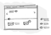
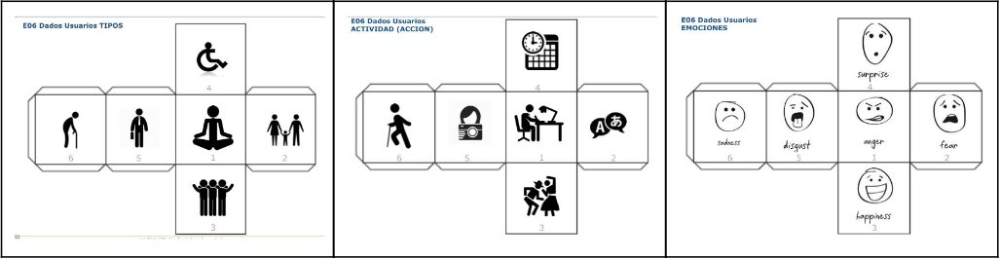

# DIU21

**Prácticas Diseño Interfaces de Usuario 2020-21**. Tema: Turismo.

> **Grupo**: DIU1.CherryPink. Curso: 2020/21.

> **Proyecto**: CherryTrip

> **Descripción**: Aplicación de viajes en la provincia de Granada ideada para la era pandémica. Accesible para todos.

> **Miembros**:
> - :bust_in_silhouette:  **Andrés Millán**    :octocat: www.github.com/Asmilex
> - :bust_in_silhouette:  **María Sánchez**    :octocat: www.github.com/LocalPinkRobin

-----

# Proceso de Diseño

## Paso 1.  UX Desk Research & Analysis

###  1.a Competitive Analysis

Entre las opciones de las que disponíamos, las cuales eran *Inspirock*, *Roadtrippers*, *Tripit* y *Lambus*, hemos optado por **Roadtrippers**. Los motivos son los siguientes:
- La página web de Tripit no cargaba para María, y Andrés no podía acceder ni a Tripit ni a Inspirock.
- Lambus necesitaba instalar aplicación en Android.
- Roadtrippers es elegante y dispone de interfaz web, por lo que nos ha resultado la más llamativa.

###  1.b Persona

Hemos creado dos personas ficticias de ámbitos muy diferentes. Ambas pueden verse en la situación de usar la aplicación seleccionada, pero cada uno con sus necesidades y requerimientos únicos. Principalmente, el daltonismo de Diego, y la movilidad reducida de Mei.

#### [User research de Diego](./img/P1/diego.png)

#### [User research de Mei](./img/P1/mei.png)

###  1.c User Journey Map

Las dos experiencias son ejemplo de uso de la aplicación. Sin embargo, hemos propuesto dos modelos: uno en el que el usuario sí quiere pagar, y otro en el que no. En ambos se presentan dificultades posibles en el proceso, descritas en la sección anterior.

Además, se comentan brevemente algunas de las funcionalidades que presenta Roadtrippers, y si están implementadas de forma efectiva.

#### [Journey map de Diego](./img/P1/JM-Diego.png)

#### [Journey map de Mei](./img/P1/JM-Mei.png)

###  1.d Usability Review

El documento se encuentra en la [carpeta P1](./P1/Usability%20review%20Roadtrippers.pdf).

En general, la aplicación es muy intuitiva de usar. Los mapas presentan claramente la ruta, marcan puntos de interés, y permite mirar rápidamente hoteles.

Sin embargo, existen una serie de problemas importantes que debemos destacar:
- Toda la interfaz está en inglés.
- Claramente el público objetivo es estadounidense. Fuera del país no se presenta el mismo nivel de detalle.
- El sistema de layers que usan para la gestión de la ruta necesita refinamiento. Algunas acciones básicas están escondidas detrás de elementos visuales ocultos a priori, como eliminar un punto de la ruta. Las capas no están bien integradas del todo, ni se justifica su existencia. Podrían haber sido sustituidas por un simple filtro.
- Si no se paga, la cantidad de puntos de ruta que se pueden añadir es mínima. Tanto, que no merece mucho la pena usarla.

Debemos hacer especial mención a la paleta de colores seleccionada por los desarrolladores. Se puede observar que, [incluso simulando los distintos tipos de daltonismo que tienen los usuarios](./img/P1/paleta/), la web sigue siendo usable. Consideramos esto un punto muy importante, pues uno de nuestras personas presenta este matiz. Las fotografías se han conseguido gracias a la web [color-blindness](https://www.color-blindness.com/coblis-color-blindness-simulator/).

En general, no estamos muy satisfechos con Roadtrippers desde el punto de vista del turismo en España, pero entendemos que hay potencial para países del extranjero. La valoración es de un 85 (Good).

## Paso 2. UX Design

###  2.a Feedback Capture Grid / EMpathy map / POV

Hemos recogido las principales sensaciones e ideas que han tenido Diego y Mei en la siguiente malla de información receptora:

Intentaremos solucionar sus problemas mediante nuestra propuesta: **Cherry Trip**.

Se trata de una aplicación de planificación de viajesque promueve eventos de ocio y cultura al aire libre. De esta forma, todos podemos disfrutar de actividades reguladas con protocolo covid, así como compartirlas con amigos y familiares en Granada.

###  2.b ScopeCanvas

Hemos recogido las ideas del proyecto en el siguiente scope canvas. De esta forma, las principales ideas se pueden reconocer a simple vista

###  2.b Tasks analysis

Es necesario pensar en los diferentes tipos de usuarios que usarán nuestra aplicación, así como las funcionalidades que emplearán. Por ello, hemos ideado el siguiente task analysis:

|                                  | **Familias** | **Grupos** | **Individuos** | **Empresas** |
|----------------------------------|--------------|------------|----------------|--------------|
| **Registrarse**                  | H            | H          | H              | M            |
| **Buscar servicios disponibles** | H            | H          | H              |              |
| **Marcar punto de ruta**         | H            | H          | H              |              |
| **Eliminar punto de ruta**       | H            | H          | H              |              |
| **Reservar servicio**            | H            | H          | H              |              |
| Anular servicio                  | L            | M          | L              |              |
| Compartir ruta                   | H            | H          | L              |              |
| Dejar reseña                     | M            | L          | M              |              |
| Solicitar ayuda                  | M            | L          | L              | M            |
| Modificar perfil                 | L            | L          | M              |              |
| Cambiar interfaz                 | L            | L          | L              | L            |
| Dar de baja un servicio          |              |            |                | L            |
| Dar de alta un servicio          |              |            |                | H            |

###  2.c IA: Sitemap + Labelling

La página web funcionará como una *PWA* (Progressive Web App). De esta forma, exportarla a otros sistemas será muy sencillo.

La estructura del sitio es la siguiente:

En la siguiente tabla se recogen los términos empleados y la funcionalidad que hay recogida tras ellos:

| Etiqueta              | Descripción                                                                                                                                                                                                                  |
|-----------------------|------------------------------------------------------------------------------------------------------------------------------------------------------------------------------------------------------------------------------|
| Home                  | Página principal del sitio. Se describen las funcionalidades de la aplicación, los protocolos Covid seguidos, enlaces a los distintos lugares de la página...                                                                |
| Iniciar sesión        | Permite a los usuarios registrarse o acceder a su cuenta con el fin de poder usar la aplicación.                                                                                                                             |
| Búsqueda              | Listado de los servicios disponibles. Se pueden buscar las actividades y los hoteles disponibles junto con su información.                                                                                                   |
| Sobre nosotros        | About us. Muestra información sobre los desarrolladores, así como el proyecto.                                                                                                                                               |
| Contacta con nosotros | Información de contacto para poder recibir asistencia.                                                                                                                                                                       |
| Preguntas frecuentes  | FAQ. Se resuelven las dudas habituales relacionadas con el uso de la aplicación, los servicios, pagos...                                                                                                                     |
| Mapa                  | Es la principal función de la aplicación. Aquí se muestran todos los servicios disponibles en el mapa del lugar deseado. Se puede visualizar la ruta, así como compartirla y reservar tras añadir todos los puntos deseados. |
| Dejar reseña          | El usuario añade una valoración sobre un servicio. Estas se mostrarán en el mapa.                                                                                                                                            |
| Compartir             | Permite difundir una ruta con otras personas. No será necesario estar registrado para verla.                                                                                                                                 |
| Reservar              | Se muestra una página similar a un carrito de la compra, con el precio de todos los servicios por separado, fechas de la reserva y el precio total.                                                                          |
| Perfil                | Información del usuario: nombre de usuario, correo, contraseña, historial de rutas... Se puede configurar también la interfaz, como aumentar el tamaño de texto, y cambiar la paleta de colores                              |
| Ofrece tus servicios  | Las empresas que quieran registrar sus negocios deben acceder a esta página. Enviarán un formulario con todo lo necesario para poder colgar su servicio.                                                                     |

###  2.d Wireframes

Finalmente, hemos creado un prototipo de interfaz que mostraría el funcionamiento de la aplicación en el escritorio. Decidimos esquematizar únicamente las partes más importantes: la página de inicio, el mapa y la búsqueda. Consideramos que la sección *About us* es estándar y no requiere especial atención.

El wireframe sería el siguiente:

#### Home page

#### Mapa

#### Búsqueda

## Paso 3. Mi UX-Case Study (diseño)

En esta práctica, vamos a definir el estilo visual de nuestra aplicación. Para conseguirlo, necesitaremos inspiración, tipografías, estilos visuales... A lo largo de este README detallaremos los pasos que hemos seguido para conseguirlo.

###  3.a Moodboard

Empezamos creando un Moodboard, un tablón con distintas imágenes inspiracionales. Nos proporcionará un buen punto de inicio. En él, figuran algunos elementos que analizaremos con más detalle en la sección [Guidelines](##Guidelines), entre los que se encuentran la tipografía y la paleta de colores.

>>> Si diseña un logotipo, explique la herramienta utilizada y la resolución empleada. ¿Puede usar esta imagen como cabecera de Twitter, por ejemplo, o necesita otra?

###   3.b Landing Page

Partiendo de nuestro [Wireframe de la práctica anterior](https://github.com/Asmilex/DIU21/tree/master/P2#prototipo-lo-fi-wireframe), diseñamos la landing page. En ella, debemos presentar el objetivo del proyecto **con claridad**. Para conseguirlo, necesitamos:
- **Un logotipo reconocible**. El nuestro lo hemos diseñado TODO
- **Un título sugerente**, seguido de **subtítulos** en los que mostremos los principales atractivos de la aplicación.
- Elementos gráficos que refuercen el significado.

El diseño de la página es del tipo scroll suave continuo, de forma que los alicientes se descubren poco a poco. Esto permite centrar la atención a unos pocos puntos a la vez.

La sección [Guidelines](##Guidelines) profundizará en los motivos tras estas elecciones.

[Puedes visitar la landing page en este enlace](https://cherrytriplandingpage.webflow.io/). Utilizamos la herramienta [Webflow](www.webflow.io) para crearla.

###  3.c Guidelines

En esta sección, definiremos el estilo visual de todos los componentes de la aplicación.

#### Logotipo

Durante del desarollo, ideamos varias versiones de nuestro logotipo. Al principio, teníamos el siguiente.

Finalmente, diseñamos el siguiente:

Esta imagen permite presentar la marca de distintas formas, lo que nos proporciona una gran versalitidad:

#### Paleta de colores

A partir de las imágenes del Moodboard, elegimos la paleta de colores de Cherry Trip.

Es una paleta con tonalidades pasteles, agradables y suaves, que recuerdan a los colores de un atardecer nuboso. Esto es perfecto para una aplicación de este tipo, pues resulta tan relajante como un viaje.

#### Iconografía

Hemos escogido los iconos [Ionicons](https://ionicons.com/) para la aplicación, puesto que son muy legibles y minimalistas. Idóneo para el branding de Cherry Trip.

Las imágenes que aparecen en la landing page han sido generadas por [Undraw](https://undraw.co). Es una página que produce diseños con un color específico indicado. Son sencillos, elegantes, gratuitos y personalizables con nuestra paleta de colores.

#### Tipografías

Principalmente se usarán dos tipografías, y se incluirá opción de escoger dos adicionales. Veámoslas:
- La tipografía utlizada para los títulos es [Bitter](https://fonts.google.com/specimen/Bitter). Es del tipo Sans-Serif. Esto produce un aire de elegancia atractivo. Uno de los principales motivos por los que la hemos elegido es que, aún siendo Sans-Serif, es muy legible.
- Para el cuerpo y los subtítulos usaremos [Inter](https://rsms.me/inter/). Es una fuente moderna diseñada específicamente para aumentar la legibilidad en pantallas. Es adaptable, tiene muchísimos glifos (lo que cubre todos los posibles idiomas a los que se pudiera expandir Cherry Trip) y funciona bien a todos los tamaños.
- Para nuestros usuarios con problemas de visión, presentamos dos opciones. Podrán seleccionar estas letras desde su configuración
  - La primera de ellas es [OpenDyslexic](https://opendyslexic.org/). Está pensada para personas *dixélicas*. Es de código abierto.
  - [Atkinson Hyperlegible](https://brailleinstitute.org/freefont), por el instituto del Braille. Se diseñó con el fin de ser legible para todo tipo de usuarios, aunque presenten problemas de vista como astigmatismo, hipermetropía o similares. Exagera los glifos para conseguirlo.

#### Patrón de diseño

Hemos utilizado una combinación de dos patrones de diseño: para la landing page, Webflow nos proporcionó un diseño similar al de las versiones antiguas de Material Design. Para el mockup High-Fi, hemos decidido implementar una variante casera del [Neumorfismo](https://uxdesign.cc/neumorphism-in-user-interfaces-b47cef3bf3a6) que se está poniendo de moda.

#### Estilo de lenguaje

El lenguaje a usar en toda la aplicación; esto es, tanto landing page, como documentos, mapa y buscador, debe ser relajado. Se debe evitar usar tecnicismos y sentencias innecesariamente largas.

El objetivo es que **Cherry Trip pueda ser usado por cualquier persona**: ya sean personas con un gran transfondo cultural, como personas que nunca habían usado antes una aplicación de viajes.

###   3.d Mockup

Pensamos que los prototipos diseñados en el Wireframe tenían potencial así que decidimos desarrollarlos. A continuación mostraremos 5 posibles pantallas de la aplicación:

Imagen del mapa la primera vez que entramos en la aplicación:

Mapa tras insertar la ciudad en la que queremos realizar nuestra actividad + paneles de selección de actividades y rutas:

Pantalla de búsqueda por actividades/hoteles/restaurantes, por si le quieres dar prioridad a esta búsqueda en vez de a la ciudad donde realizarla:

Métodos de pago actualizados a las nuevas tecnologías:

Ajustes de usuario que incluyen personalización para la mejor adaptación y experiencia de usuario:

###  3.e ¿My UX-Case Study?

Dado que nuestro case study ha tomado forma, es hora de publicarlo para que el resto de personas puedan leerlo.

Github proporciona una herramienta llamada [Github Pages](https://pages.github.com/). Para simplificar el proceso y conseguir un buen diseño de base, usamos [Docsify](https://docsify.js.org/#/). Aunque está diseñada para documentación del código, podemos adaptarlo para nuestro README principal.

El resultado se puede ver en la página [asmilex.github.io/DIU21](https://asmilex.github.io/DIU21/#/).

## Paso 4. Evaluación

###  4.a Caso asignado

Para esta parte, se nos asignaron dos posibles equipos para los cuales analizaríamos su trabajo. Elejimos [Afterwork](https://github.com/VictorRubia/DIU21), pues su aplicación **Mira2** nos resultó llamativa.

###  4.b User Testing

Para la evaluación de las eplicaciones A y B hemos usado la récnica de rolplaying.
Hemos creado 4 personajes ficticios (2 para cada aplicación) usando los dados proporcionados:

El género de los sujetos también fue aleatorio, al igual que la edad y su nivel de control de las TIC.

Partiendo de los resultados de los dados, creamos las siguientes personas:

- **Primer personaje**: 5, 2, 2. (Aplicación A)
María es una mujer de 35 años que trabaja traduciendo contenido en una estación de radio. Tiene un nivel alto en el manejo de las tecnologías (8/10). Debido a su poca experiencia, tuvo un poco de miedo usando la aplicación. Finalmente, fue una experiencia agradable e intuitiva.
- **Segundo personaje**: 4, 3, 5. (Aplicación A)
Rubén es un planificador de bodas de 55 años que presenta una discapacidad motora en su pierna izquierda. Tiene un nivel medio en uso de tecnologías. En primer lugar estaba a disgusto, ya que tenía que preparar el viaje y no se lleva bien con las tecnologías. Por suerte, la simplicidad de la app hizo más amena su experiencia.
- **Tercer personaje**: 2, 4, 5. (Aplicación B)
José Ángel es un padre de familia de 28 que trabaja como dentista. Está estresado con su ajetreada vida y su primer hijo. No es amigo de la tecnología (3/10). En general, está satisfecho con la aplicación. No obstante, veremos los puntos de la encuesta SUS, pues muestran un margen de mejora en su opinión.
- **Cuarto personaje**: 1, 2, 3. (Aplicación B)
Olga es una cheff internacional de 45 años. Es una persona tranquila y espiritual. Le gusta explorar la cultura de los países y ciudades que visita por su trabajo. Tiene un nivel alto de uso de tecnología (8/10), lo cual facilita su interacción con la app. Esta experiencia es positiva, al igual que su actitud.

### . 4.c Cuestionario SUS

Para realizar un análisis de ambas aplicaciones, usaremos un cuestionario SUS. Aunque hay pocos encuestados, y son ficticios, es suficiente para estudiar los fallos que presentan.

Los resultados obtenidos son los siguientes:

Debemos destacar positivamente los resultados obtenidos por CherryTrip. El esfuerzo realizado para conseguir una aplicación cohesionada, simple e intuitiva han dado sus frutos. La sencillez de su uso es lo que más ha influenciado a los participantes ficticios.

En la siguiente sección comentaremos los resultados obtenidos para Mira2.

###  4.d Usability Report

Por último, realizamos un estudio de la aplicación Mira2, el cual puede leerse con detenimiento en [este enlace](https://github.com/Asmilex/DIU21/blob/master/P4/SUS%20y%20Usability%20Report%20de%20Mira2.pdf).

## Conclusión final / Valoración de las prácticas

Aquí concluyen las prácticas de la asignatura DIU del año 2021. En ellas, hemos estudiado las necesidades del sector en la era pandémica, diseñado un branding y realizado un esquema de posible aplicación. Finalmente, analizamos la competencia resultante, intentando ver qué implementaciones han funcionado mejor y por qué.

Este proceso ha sido muy instructivo, y es un fiel reflejo de la realidad.